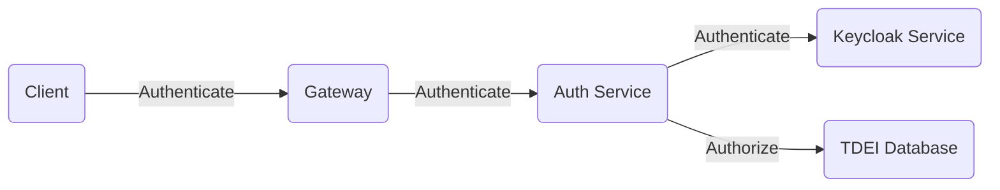

# Introduction

Authentication/Authorization API, this API is responsible for any service related to the authentication and
authorization of
the
user, like authenticating the users, issuing the access/refresh tokens, api keys, validating the permissions for the
users.

## System flow diagram

Below diagram depicts the system flow for Authentication service



- `Auth Service` is responsible for Authenticating and Authorizing the HTTP requests. Also, verifies the access token,
  api-key on request and generates the secret token
  for intra micro-service communication.
- `Gateway` service is first point of contact for clients. Every request to gateway is Authenticated & Authorized
  against
  the `Auth Service`.
- For Authentication, `Auth Service` will interact with `Keycloak Service` for verification.
    - Successful authentication auth service will return with access_token & refresh_token as a response to requests.
- For Authorization, `Auth Service` will interact directly with `TDEI Database`. `TDEI Database` maintains the user
  roles and permissions.

## System requirements

| Software | Version |
|----------|---------|
| Java     | 17      |
| Maven    | > 3     |
| Spring   | 2.7.4   |

## Development IDE tool preference

Eclipse (https://www.eclipse.org/downloads/)

Intellij (https://www.jetbrains.com/idea/download)

## Dependencies

Other third-party dependencies used in the project please browse the Maven pom.xml file for details of libraries and
versions used.

## Cloning the project

Clone the project from source controller

```aidl
$ git clone https://github.com/TaskarCenterAtUW/TDEI-auth-n-z.git
```

## Secrets

Application secrets are not included in the code repository. Below are the instruction for each environment

###### DEV

Create **developer-local-properties.yaml** file under root of `resource` folder and override the application.yaml
placeholders.

```src/main/resources/developer-local-properties.yaml```

###### PROD

Secrets are configured as an environment variables on the deployment server.

###### Environment variable

|  Name   | Description                          |
|-----|--------------------------------------|
|  KEYCLOAK_CREDENTIALS_SECRET | Keycloak secret from portal          |
|  SPRING_DATASOURCE_URL  | Database JDBC URL                    |
|  SPRING_DATASOURCE_USERNAME | Database user name                   |
|  SPRING_DATASOURCE_PASSWORD | Database password                    |
|  SPRING_APPLICATION_SECRET | Secret key for token generation      |
|  SPRING_APPLICATION_SECRET_TTL | Secret token time to live in seconds |
|  KEYCLOAK_CLIENT_ENDPOINTS_USER_URL | Keycloak user url                    |
|  KEYCLOAK_CLIENT_ENDPOINTS_TOKEN_URL | Keycloak Token url                   |
|  KEYCLOAK_AUTH_SERVER_URL | Keycloak auth server url             |
|  SPRING_PROFILES_ACTIVE | Active profile [dev,stage,prod]      |

## Building the project

### IDE

Import the project in your preferred IDE by selecting POM.xml.

### Cli

*Note: Navigate to the cloned repository directory before proceeding for below steps

### 1. Building the server

Use Maven command to build the server. Below mvn command will

1. Cleans the project and removes all files generated by the previous build
2. Builds the maven project and generates the jar package to target directory

```
$ mvn clean install
```

### 2. Running the server

```
$ cd target
$ java -jar -Dspring.profiles.active=dev gateway-0.0.1.jar
```

### 3. Browse API documentation

Navigate to the below link for API documentation and API playground

http://localhost:8080/swagger-ui/index.html

## Development API documentation link

https://tdei-gateway.azurewebsites.net/swagger-ui/index.html